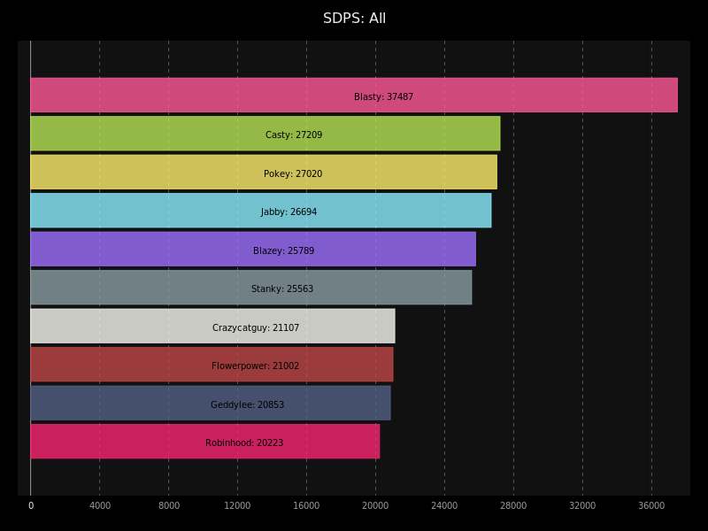

# Welcome
EQParseTables exists to turn the forum output from GamParse into tables of
various formats in order to facilitate easy comparison.

Noticing that a_cleric03 is casting way more spells than you and getting
showered with phatlewtz and the adoration of the tanks? No problem! Fire up
EQParseTables and instantly compare your cast counts itemized by spell. Geek
out over the breakdown of various spell types in beautiful stacked bar graphs
and see exactly who's doing what.

If you've ever wanted to take a game way too seriously, EQParseTables can help
you make that dream come true!

## Using EQParseTables
For the time being, EQParseTables is a console application. You'll need to paste
the forum output from GamParse into a file and point the script at it. For
example, if you save your parse summary as healparse.txt, you'd call 

```bash
$ python3 eqparsetables.py healparse.txt
```

from the command line. For your convenience, EQParseTables looks for data in a
file called parse.txt if no path is given. Your parse data will be converted
into a forum-friendly table format, including casting or DPS graphs like the
following (names have been changed to protect the innocent):




### Combining Parses

It is also possible to combine cast parses from multiple sources into one in
order to get more accurate results. Given the nature of logging in EQ and the
data output by GamParse, EQParseTables uses a relatively naive method of
combining data from multiple sources. For each spell cast, the highest cast
count is taken for each player. For example, given two input sources containing

```
[B]Combined: An enraged lemming on 7/26/2016[/B]
 
[B]Healzalot - 149[/B]
   --- Huge Healing - 100
   --- Pretty Big Healing - 49
 
[B]Healzalittle - 15[/B]
   --- Huge Healing - 10
   --- Pretty Big Healing - 5
 
[B]Produced by GamParse v1.5.1.6[/B]
```

and

```
[B]Combined: An enraged lemming on 7/26/2016[/B]
 
[B]Healzalot - 135[/B]
   --- Huge Healing - 85
   --- Pretty Big Healing - 50
 
[B]Healzalittle - 19[/B]
   --- Huge Healing - 15
   --- Pretty Big Healing - 4
 
[B]Produced by GamParse v1.5.1.6[/B]
```

you would end up with a table showing Healzalot having cast Huge Healing 100
times and Pretty Big Healing 50 times, with Healzalittle having cast them 15
and 5 times, respectively.

### Blocklisting Spells
Let's face it, not every spellcast that ends up in your log file is necessarily
interesting. Does anyone care that a cleric cast Lesser Yaulp 342 times on last
night's raid? Not likely. That's where the blocklist comes in.

Create a file named `blocklist.ini` in the directory with eqparsetables.py or
direct EQParseTables to a custom blocklist using the `-b` switch followed by
the path to your custom blocklist. Blocklisting a spell is then as simple as
adding a line to that file containing only the name of the spell you want
blocklisted. Don't worry about adding spell ranks to the end of the name;
EQParseTables takes care of that for you. For instance, if you want to
blocklist all ranks of Lesser Yaulp, just add the line

`Lesser Yaulp`

to your blocklist.ini! Since EQParseTables blocklists anything beginning with
the spell names you type in, ignoring those annoying placeholder clickies and
illusions is as easy as adding

`Shadow of`

`Illusion:`

to the blocklist. Hooray!

### Player Config
Since GamParse summaries don't include players' classes, you'll need to set up a
file called `config.ini` in your EQParseTables directory. This is what's known
as a CSV (comma separated values) file, and adding a player is as easy as adding
a line for each player containing his or her name, EQ class abbreviation, and
nickname. For instance, if you have a druid with the ridiculously long and just
plain ridiculous name Evilhealzforthewin, simply add this to your config.ini:

`Evilhealzforthewin,DRU,Evil`

This will allow EQParseTables to recognize your character in the parse summary
and assign it to the proper table. It will also change your character's name to
Evil in the table header so that things stay nice and tidy.


# Dependencies
EQParseTables needs the following modules to be installed on your system
(either globally or in a virtual environment) in order to run:
* cairocffi
* cairosvg
* cssselect
* lxml
* pygal
* tinycss
